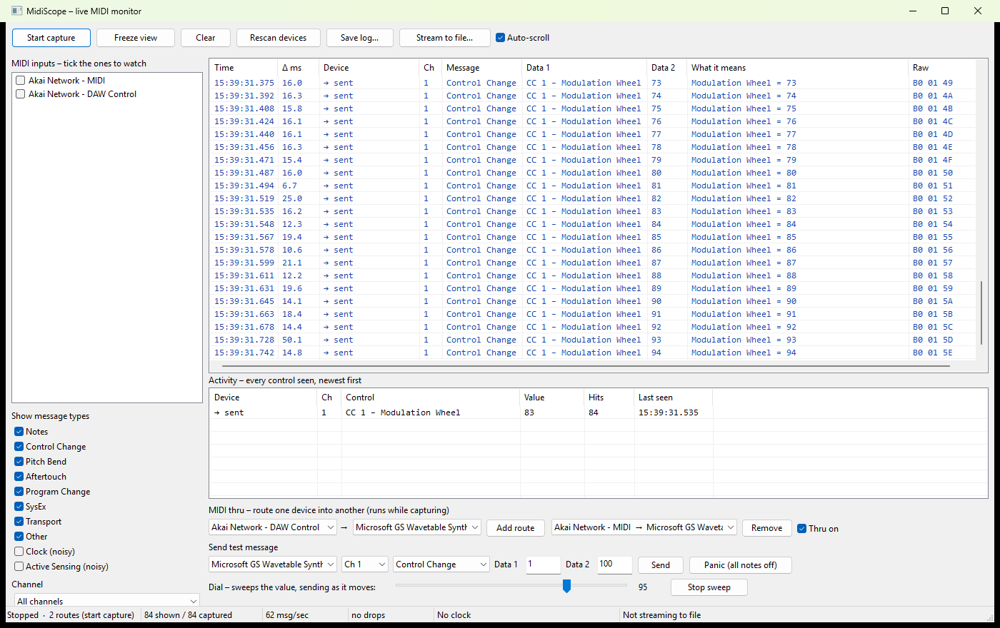

# MidiScope

**A live MIDI monitor and diagnostic window for Windows.** Tick one or many
connected controllers, watch exactly what they send as you touch them, route one
device into another, and save the whole session to a file.

[](LICENSE)
-0078D6)




---

## Download

**[⬇ Download MidiScope v1.0.0 (Windows 64-bit, 141 KB)](https://github.com/mrdatacommando/midi-controller-diagnostics/raw/main/releases/MidiScope-v1.0.0-win64.zip)**

Unzip it and double-click `MidiScope.exe`. There is nothing to install — no
runtime, no .NET, no Visual C++ redistributable, no admin rights. The whole
program is a single 290 KB file built directly on Windows' own MIDI API.

> The first time you run it, Windows may show a blue *"Windows protected your
> PC"* box. That is SmartScreen reacting to an executable it hasn't seen before,
> not a virus warning — the file simply isn't code-signed. Click **More info**,
> then **Run anyway**.

Checksum: [`MidiScope-v1.0.0-win64.zip.sha256`](releases/MidiScope-v1.0.0-win64.zip.sha256)

Prefer to build it yourself? See [Building from source](#building-from-source).

---

## What it does

### Pick your devices

Every MIDI input Windows can see is listed with a checkbox: hardware
controllers, USB keyboards, network ports, virtual cables like loopMIDI. Tick as
many as you like and they are all captured into one merged, timestamped stream.
Devices are re-scanned automatically when you plug something in.

### Watch it live

Each message appears with a millisecond timestamp, the gap since the previous
line, which device sent it, and a plain-English reading of what it means:

| Time | Δ ms | Device | Ch | Message | Data 1 | What it means |
|---|---|---|---|---|---|---|
| 15:04:31.118 | – | KeyLab 61 | 1 | Note On | D3 (50) | D3 struck, velocity 97 |
| 15:04:31.402 | 284.0 | KeyLab 61 | 1 | Control Change | CC 1 – Modulation Wheel | Modulation Wheel = 64 |
| 15:04:31.655 | 253.0 | KeyLab 61 | 1 | Pitch Bend | LSB 0 | +2412 (29.4% up) |

Rows are coloured by message type, so a controller's activity is obvious at a
glance. It decodes all 128 standard CC names, General MIDI patch names, note
names, 14-bit pitch bend, aftertouch, transport, and SysEx with manufacturer ID
lookup.

### Find out what a knob is

The activity panel lists every control that has moved, newest first, with its
current value and a hit count. Wiggle an unknown knob and it jumps to the top
with its CC number — usually the whole reason you opened a MIDI monitor.

### Read the tempo

When a device sends MIDI timing clock, MidiScope measures the tempo from it,
averaged over the last 10 clock intervals, and shows which device it is coming
from — in the status bar (`♩ 120.6 BPM – Akai Network`), on every clock row, and
as its own activity row. This works even with **Clock** unticked, so you get a
live BPM readout without the clock stream flooding the feed.

### Route one device into another

The MIDI thru row connects any input to any output. Pick a From and a To, press
**Add route**, and everything arriving on that input is passed straight out —
notes, CC, pitch bend, transport and SysEx. One input can fan out to several
outputs; add a route per destination.

Forwarding happens inside the MIDI input callback rather than on the display
timer, so playing through it stays tight. Routes are remembered by device, so
stopping and restarting capture reconnects them, and turning **Thru on** off
sends All Notes Off so nothing is left ringing on the far side. Thru is live only
while capture is running — the status bar says so if you have routes set up but
are stopped.

Routing a port back into its own other half is an easy way to build a feedback
loop, so MidiScope asks before wiring an input to an output of the same name.

### Filter the noise

Toggle message types and narrow to a single channel. Clock and Active Sensing
start switched off, because they arrive hundreds of times a second and bury
everything else.

### Save the log

**Save log…** writes everything captured to CSV (opens straight into Excel),
JSON Lines, or aligned plain text. **Stream to file…** writes continuously as
messages arrive, so a long soak test survives a crash or a power cut. Filters
only affect the display — the log always gets everything.

### Send test messages

Fire notes, CCs, program changes, pitch bend and transport at any MIDI output to
check a device responds, with a Panic button that sends All Notes Off and All
Sound Off on all 16 channels. Anything you send is echoed into the feed marked
`→ sent`, so a round trip is visible in one place.

### Sweep a value with the dial

The dial sends continuously as it moves, which is what you want for checking that
a receiving control actually tracks an incoming CC. It drives the *value* of
whatever message type is selected, so one control covers several tests:

| Selected type | What the dial sweeps |
|---|---|
| Control Change | the value of the CC number in **Data 1** |
| Note On | velocity, for testing velocity response |
| Pitch Bend | the full 14-bit range, 0 to 16383 |
| Program Change / Ch Aftertouch | the single data byte |

**Sweep 0–127** runs the whole range up and back down on its own, so you can
watch a remote dial follow without holding the mouse.

---

## Using it

1. Run `MidiScope.exe`.
2. Tick the inputs you want in the list on the left.
3. **Start capture**, then play or touch your controller.
4. **Save log…** when you want the session on disk.

**Freeze view** holds the display still while capture continues underneath, for
reading something that just scrolled past. **Clear** empties the buffer. The
status bar shows the capture state, message counts, throughput, dropped-message
count, live tempo and the streaming log.

If a device fails to open, MidiScope says which one and why — most often because
a DAW already has the port open exclusively.

---

## Building from source

Needs [CMake](https://cmake.org/download/) 3.20+ and MSVC (Visual Studio 2022,
or just the [Build Tools](https://visualstudio.microsoft.com/downloads/)).

```bash
git clone https://github.com/mrdatacommando/midi-controller-diagnostics.git
cd midi-controller-diagnostics
cmake -S . -B build -G "Visual Studio 17 2022" -A x64
cmake --build build --config Release
```

The executable lands in `build/Release/MidiScope.exe`. It links only against
`winmm`, `comctl32`, `comdlg32` and `shlwapi` — all part of Windows — and uses
the static CRT, so the result is genuinely standalone.

To produce a distributable zip, which rebuilds cleanly, refuses to package if
there are any compiler warnings or a failing test, and writes to `releases/`:

```bash
powershell -ExecutionPolicy Bypass -File packaging\make-release.ps1
```

### Self-test

`MidiScopeSelfTest.exe` covers everything except the window: the decoder tables,
tempo estimation, all three log formats, thru route setup and teardown, and the
device open/capture/close lifecycle run repeatedly to prove a restart is clean.

It is deliberately passive — it opens inputs and listens, and wires up thru
routes without ever switching forwarding on, so running it cannot make your
hardware or a software synth produce a sound.

```bash
build\Release\MidiScopeSelfTest.exe
```

It also prints the MIDI devices it can see, which is a quick way to check
Windows is detecting a controller at all.

---

## How it is put together

| File | Role |
|---|---|
| `src/midi_engine.*` | Device enumeration, capture and thru. winmm callbacks copy into a fixed 65536-entry ring buffer and signal a helper thread to recycle SysEx buffers, because those callbacks may only call a short list of functions. The UI drains the ring on a 30 ms timer. |
| `src/midi_decode.*` | Pure functions turning bytes into text: CC and GM tables, note names, pitch bend, SysEx manufacturer IDs, plus `ClockTracker` for tempo. |
| `src/log_writer.*` | CSV, JSON Lines and text output, plus the streaming logger. Takes a `Source` interface rather than the engine, so device names and SysEx payloads stay correct across a stop/restart. |
| `src/main.cpp` | Win32 window, virtual list views, filters, activity panel, thru and send panels. |
| `tests/selftest.cpp` | Console harness for everything that isn't the window. |

A few details worth knowing if you change it.

Device slots and SysEx indices are renumbered by the engine on every start, so
the app copies them into its own session-wide numbering as events are drained —
otherwise events captured before a restart would name the wrong device. The
engine also restarts its clock at zero each time, so later captures are offset
onto the display timeline rather than jumping backwards.

Thru has its own wrinkle. `midiOutShortMsg` is one of the few calls a MIDI input
callback is permitted to make, which is what lets short messages be forwarded
from inside the callback with no added latency. SysEx cannot go the same way —
`midiOutLongMsg` needs a prepared buffer — so those are handed to the helper
thread instead, which is fine given a patch dump does not care about a
millisecond. The route table is only ever read under the lock, and output handles
are always closed *after* the table has been detached, so a callback can never be
left holding one.

The message feed is an owner-data list view holding up to 300,000 events, so it
stays responsive under a dense SysEx dump or a flood of clock.

---

## Contributing

Issues and pull requests are welcome. If you are sending a change, please keep
the build free of warnings (it compiles at `/W4`) and make sure
`MidiScopeSelfTest.exe` still passes.

Bug reports are much easier to act on with a saved log attached — capture the
problem, **Save log…** as CSV, and include the file along with the make and model
of the device.

---

## Licence

[MIT](LICENSE) — free to use, modify and redistribute, including commercially,
as long as the copyright notice comes along.

Copyright © 2026 Mark Van de Velde.
